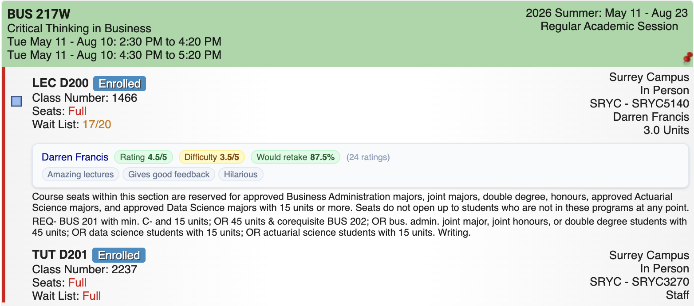
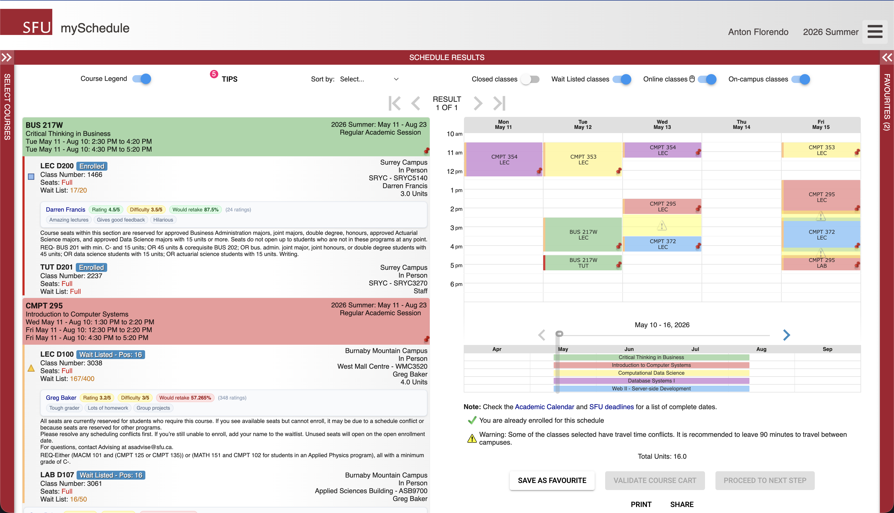

# SFU MyProfessor

A Chrome extension that injects Rate My Professor ratings directly into the SFU MySchedule course schedule.

## Chrome Store
https://chromewebstore.google.com/detail/agcnjhkelnjokbchcjkldkphdkdclonp?utm_source=item-share-cb

## What it does

On `https://myschedule.erp.sfu.ca/*`, a new row is inserted under each instructor entry showing:

- Professor name
- Average rating
- Average difficulty
- Would-take-again percentage
- Top student-reported rating tags

###  UI
**Card view**



**Fullscreen**



## Tech Stack

| Layer              | Technology                  |
| ------------------ | --------------------------- |
| Build              | WXT                         |
| Extension format   | Chrome Manifest V3          |
| Background worker  | TypeScript                  |
| Content script     | TypeScript                  |
| Styling            | Tailwind CSS v4 via PostCSS |
| RMP lookups        | Custom GraphQL client       |

## Architecture

```text
SFU MySchedule page
  |
  |-- content script: src/entrypoints/content.ts
  |    - scans instructor cells (div.rightnclear[title="Instructor(s)"])
  |    - deduplicates with a processed Map and in-flight processing Set
  |    - sends FETCH_DATA messages to the background worker
  |    - builds and inserts a <tr> rating card after each instructor row
  |
  |-- content stylesheet: src/content/content.css
  |    - imports Tailwind CSS v4 utilities (prefix: tw:) used by injected rows
  |
  |-- background worker: src/background/background.ts
  |    - receives FETCH_DATA messages from the content script
  |    - delegates to src/background/rmp.ts
  |    - returns professor data to the content script
  |
  |-- RMP client: src/background/rmp.ts
  |    - custom GraphQL client for the RMP API
  |    - fetches and caches the SFU school ID for the service worker lifetime
  |    - searches for a teacher by name scoped to Simon Fraser University
  |
  |-- shared types: src/shared/professor.ts
       - ProfessorData interface, message types, and isFetchDataRequest type guard
```
## Project Structure

```text
sfu-myprofessor/
├── package.json
├── postcss.config.js
├── tsconfig.json
├── wxt.config.ts
├── scripts/
│   └── patch-wxt-local-fetch.mjs
├── src/
│   ├── background/
│   │   ├── background.ts
│   │   └── rmp.ts
│   ├── content/
│   │   └── content.css
│   ├── shared/
│   │   └── professor.ts
│   └── entrypoints/
│       ├── background.ts
│       ├── content.ts
│       └── popup.html
└── .output/
```

## Getting Started

### Prerequisites

- Node.js 18+
- Chrome or another Chromium-based browser

### Install dependencies

```bash
npm install
```

### Build the extension

```bash
npm run build
```

### Development mode

```bash
npm run dev
```

WXT starts Chrome MV3 development mode and writes the dev build to `.output/chrome-mv3-dev/`.


## Permissions

| Permission                         | Why it is present                                                          |
| ---------------------------------- | -------------------------------------------------------------------------- |
| `storage`                          | Declared for future persistent caching, not currently used                 |
| `https://*.ratemyprofessors.com/*` | Allows the background worker to fetch professor data from RMP              |
| `https://myschedule.erp.sfu.ca/*`  | Allows the content script to run on the SFU schedule site                  |

## Troubleshooting

**No ratings appear**
- Confirm the extension is enabled in `chrome://extensions`
- Make sure you loaded the built `.output/chrome-mv3/` directory, not `src/`
- Check the page URL matches `https://myschedule.erp.sfu.ca/*`
- Open DevTools console and look for extension errors

**Ratings stop appearing after navigating within MySchedule**
- Reload the MySchedule page so the content script re-runs

**A professor row never gets data**
- The instructor name may not match any RMP record for Simon Fraser University
- No not-found state is displayed in the current version

## What's Next

- **Smarter caching**: Professor lookups could use a time-to-live (TTL) layer so repeat visits do not always hit Rate My Professor. A small remote cache (for example **Redis**) or extension storage with expiry would reduce API traffic and speed up the schedule view.

## Contributing

Contributions are welcome. Open a pull request, or reach out if you want to discuss an idea before coding.

## License

MIT — see [`LICENSE`](./LICENSE).
