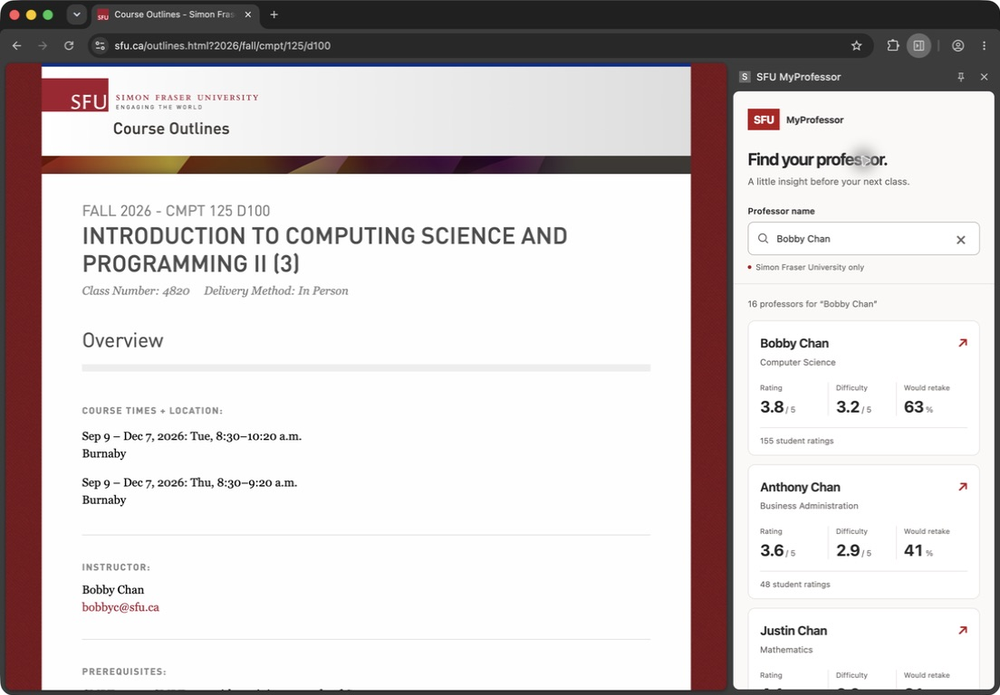
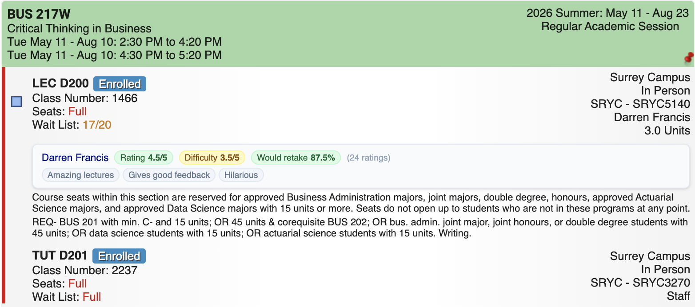
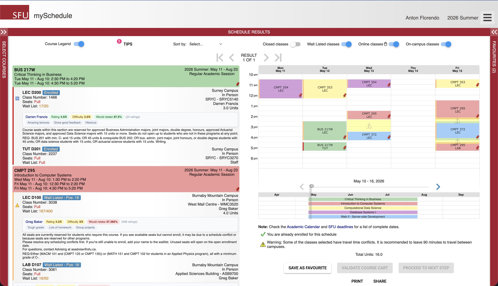

# SFU MyProfessor

A Chrome extension that searches SFU professors in a side panel and injects Rate My Professors ratings directly into the SFU MySchedule course schedule.

## Chrome Store
https://chromewebstore.google.com/detail/agcnjhkelnjokbchcjkldkphdkdclonp?utm_source=item-share-cb

## What it does

### Professor search

Click the **SFU MyProfessor** extension icon to open the Chrome side panel on any website. Pin the extension from Chrome's Extensions menu for quick access.

- Search by first or last name; results appear after at least two characters and a short typing delay. Press Enter to search immediately.
- View names, departments, ratings, difficulty, would-retake percentages, and student rating counts. Click a professor's name to open their RMP profile in a new tab.
- Searches use the main **Simon Fraser University** listing already used by the schedule lookup. Results are checked against that school's ID; this is not a complete SFU faculty directory or an aggregation of separate campus listings.
- Shows up to 20 matches. If more exist, narrow the name to find the professor you want.
- Missing scores appear as `—`. Empty results and temporary failures have distinct states, with a retry button for failures.
- The panel remains available when switching tabs; it does not require an SFU page to be open.

### Schedule ratings

On `https://myschedule.erp.sfu.ca/*`, a new row is inserted under each instructor entry showing:

- Professor name
- Average rating
- Average difficulty
- Would-take-again percentage
- Top student-reported rating tags

## Screenshots

### New in 1.3.0: professor search

Look up an instructor while viewing their course outline. The screenshot below shows the native Chrome side panel searching for Bobby Chan beside SFU's CMPT 125 course page, with ratings, difficulty, and would-retake percentages visible without leaving the tab.



### MySchedule integration

**Card view**



**Fullscreen**



## Tech Stack

| Layer              | Technology                  |
| ------------------ | --------------------------- |
| Build              | WXT                         |
| Extension format   | Chrome Manifest V3          |
| Background worker  | TypeScript                  |
| Content script     | TypeScript                  |
| Styling            | Tailwind CSS v4 via PostCSS |
| RMP lookups        | Custom GraphQL client       |

## Architecture

```text
SFU MySchedule page
  |
  |-- content script: src/entrypoints/content.ts
  |    - scans instructor cells (div.rightnclear[title="Instructor(s)"])
  |    - deduplicates with a processed Map and in-flight processing Set
  |    - sends FETCH_DATA messages to the background worker
  |    - builds and inserts a <tr> rating card after each instructor row
  |
  |-- content stylesheet: src/content/content.css
  |    - imports Tailwind CSS v4 utilities (prefix: tw:) used by injected rows
  |
  |-- background worker: src/background/background.ts
  |    - receives FETCH_DATA messages from the content script
  |    - delegates to src/background/rmp.ts
  |    - returns professor data to the content script
  |
  |-- RMP client: src/background/rmp.ts
  |    - custom GraphQL client for the RMP API
  |    - fetches and caches the SFU school ID for the service worker lifetime
  |    - searches for a teacher by name scoped to Simon Fraser University
  |
  |-- shared types: src/shared/professor.ts
  |    - schedule and search data contracts, message types, and request validation
  |
  |-- side panel: src/entrypoints/sidepanel/
  |    - search form, result cards, loading/empty/error states, and scoped CSS
  |    - sends SEARCH_PROFESSORS messages to the background worker
  |
  |-- search controller: src/sidepanel/search-controller.ts
       - debounces typing and ignores stale responses
```
## Project Structure

```text
sfu-myprofessor/
├── package.json
├── postcss.config.js
├── tsconfig.json
├── wxt.config.ts
├── scripts/
│   └── patch-wxt-local-fetch.mjs
├── src/
│   ├── background/
│   │   ├── background.ts
│   │   └── rmp.ts
│   ├── content/
│   │   └── content.css
│   ├── shared/
│   │   └── professor.ts
│   └── entrypoints/
│       ├── background.ts
│       ├── content.ts
│       └── sidepanel/
│           ├── index.html
│           ├── main.ts
│           └── style.css
└── .output/
```

## Getting Started

### Prerequisites

- Node.js 18+
- Chrome 116+ (the side panel uses Chrome's Side Panel API)

### Install dependencies

```bash
npm install
```

### Build the extension

```bash
npm run build
```

### Development mode

```bash
npm run dev
```

WXT starts Chrome MV3 development mode and writes the dev build to `.output/chrome-mv3-dev/`.

### Verify changes

```bash
npm test
npm run typecheck
npm run build
```

Tests exercise school filtering, score normalization, error handling, background messages, search debouncing, stale responses, and the existing schedule lookup contract. They use Node's test runner and esbuild to load TypeScript; no live RMP calls are required.

After building, reload the extension at `chrome://extensions` (or load `.output/chrome-mv3/` with **Load unpacked**). Click the toolbar icon, search a partial name, follow a profile link, and switch tabs. Also check that MySchedule still inserts rating cards.


## Permissions

| Permission                         | Why it is present                                                          |
| ---------------------------------- | -------------------------------------------------------------------------- |
| `storage`                          | Declared for future persistent caching, not currently used                 |
| `sidePanel`                        | Displays professor search beside the current webpage                      |
| `https://*.ratemyprofessors.com/*` | Allows the background worker to fetch professor data from RMP              |
| `https://myschedule.erp.sfu.ca/*`  | Allows the content script to run on the SFU schedule site                  |

## Troubleshooting

**No ratings appear**
- Confirm the extension is enabled in `chrome://extensions`
- Make sure you loaded the built `.output/chrome-mv3/` directory, not `src/`
- Check the page URL matches `https://myschedule.erp.sfu.ca/*`
- Open DevTools console and look for extension errors

**Ratings stop appearing after navigating within MySchedule**
- Reload the MySchedule page so the content script re-runs

**A professor row never gets data**
- The instructor name may not match any RMP record for Simon Fraser University
- No not-found state is displayed in the current version

## What's Next

- **Smarter caching**: Professor lookups could use a time-to-live (TTL) layer so repeat visits do not always hit Rate My Professor. A small remote cache (for example **Redis**) or extension storage with expiry would reduce API traffic and speed up the schedule view.

## Contributing

Contributions are welcome. Open a pull request, or reach out if you want to discuss an idea before coding.

## License

MIT — see [`LICENSE`](./LICENSE).
